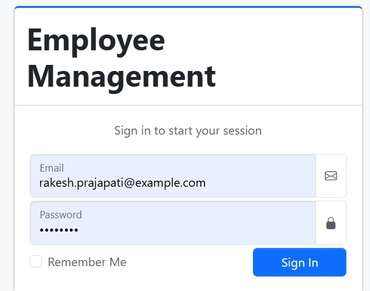
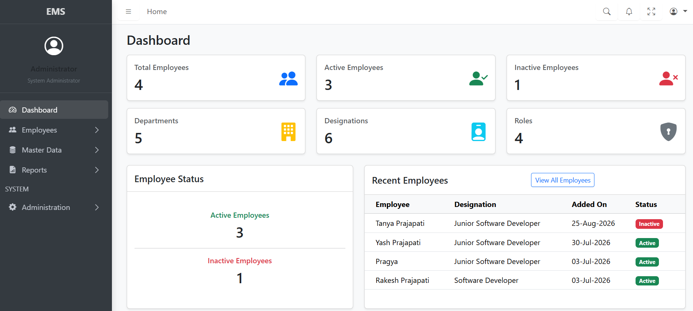
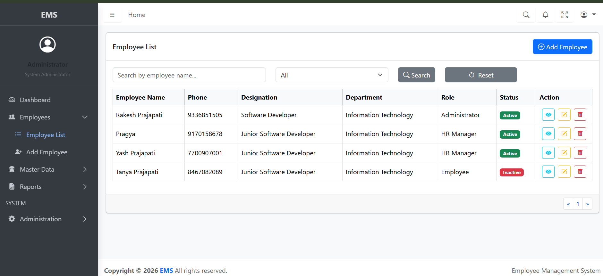
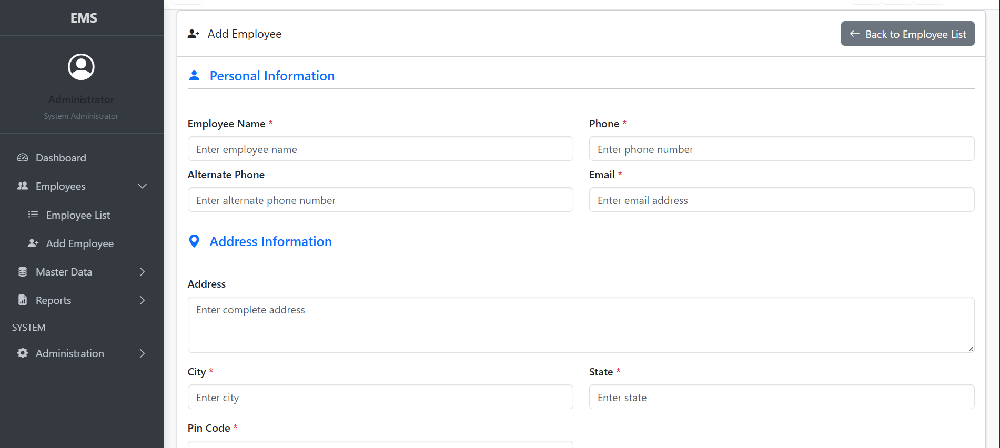
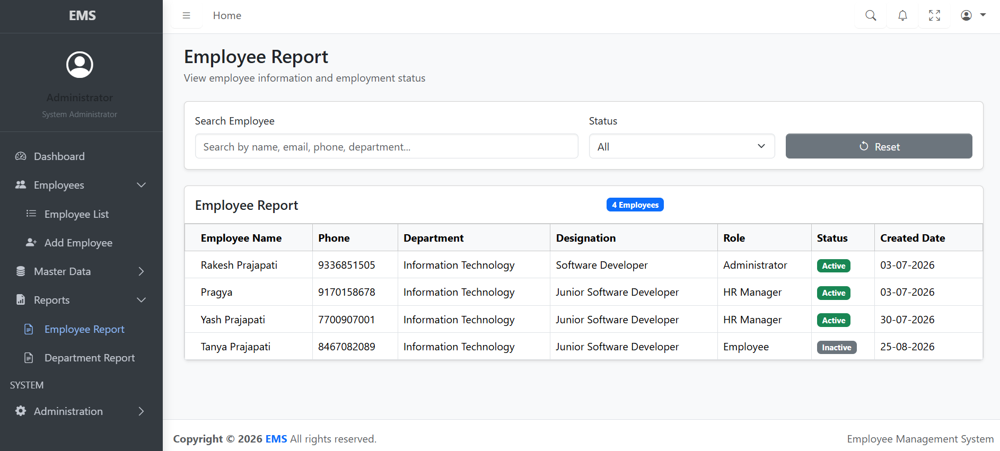
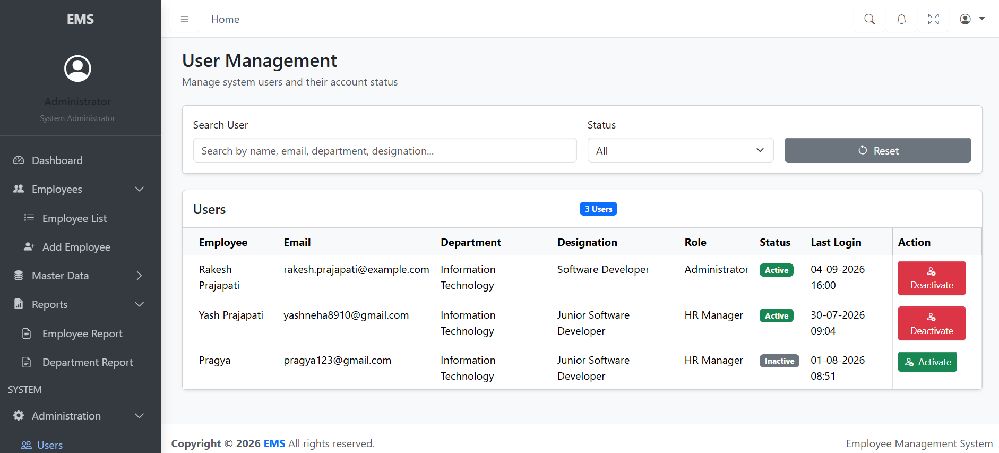

# Employee Management System

An Employee Management System frontend built using **Angular 21**, designed to communicate with an **ASP.NET Core 10 Web API** backend and **SQL Server** database.

The application provides employee, department, designation, role, user administration, authentication, dashboard, and reporting functionality through a structured and modular architecture.

## Features

### Authentication & Security

* Employee login
* JWT-based authentication
* Refresh token support
* Authentication guard for protected routes
* HTTP interceptor for attaching JWT tokens to API requests
* Automatic handling of unauthorized API responses
* Change password functionality
* User logout

### Dashboard

* Employee summary
* Department summary
* Designation summary
* Role summary
* Active/inactive status information
* Recent employee information

### Employee Management

* Add employee
* Edit employee
* View employee details
* Delete employee
* Search employees
* Filter employees by status
* Department, designation and role selection
* Employee validation

### Department Management

* Add department
* Edit department
* View department details
* Delete department
* Search/filter departments
* Active/inactive status

### Designation Management

* Add designation
* Edit designation
* View designation details
* Delete designation
* Search/filter designations
* Department association
* Active/inactive status

### Role Management

* Add role
* Edit role
* View role details
* Delete role
* Search/filter roles
* Active/inactive status

### User Administration

* View users
* Manage user status
* User profile information

### Reports

* Employee Report
* Department Report
* Search/filter report data

### User Interface

* Responsive administrative layout
* Navigation bar
* Sidebar navigation
* Toast notifications
* Form validation
* Loading indicators
* Active/inactive status badges

## 📸 Screenshots

### Login



### Dashboard 



### Employee List



### Add Employee



### Employee Report



### User Management



## Technology Stack

### Frontend

* Angular 21
* TypeScript
* HTML5
* CSS3
* Bootstrap
* AdminLTE
* RxJS

### Backend Integration

* ASP.NET Core 10 Web API
* C#
* Entity Framework Core 10
* JWT Authentication
* Refresh Tokens

### Database

* Microsoft SQL Server
* Entity Framework Core 10

### Development Tools

* Visual Studio Code
* Git
* GitHub

## Project Architecture

The Angular application follows a feature-based structure with shared services, models, guards and interceptors.

```text
src/
└── app/
    ├── core/
    │   ├── guards/
    │   ├── interceptors/
    │   └── services/
    │       ├── administration/
    │       ├── auth/
    │       ├── department/
    │       ├── designation/
    │       └── employee/
    │
    ├── features/
    │   ├── administrator/
    │   ├── auth/
    │   ├── change-password/
    │   ├── dashboard/
    │   ├── departments/
    │   ├── designations/
    │   ├── employees/
    │   ├── profile/
    │   ├── reports/
    │   └── roles/
    │
    ├── layouts/
    │   └── admin-layout/
    │
    ├── models/
    │   ├── administration/
    │   ├── auth/
    │   ├── designation/
    │   └── employee/
    │
    └── shared/
        ├── components/
        ├── services/
        └── api-response.ts
```

## Authentication Flow

The application uses JWT authentication with refresh token support.

1. User enters login credentials.
2. Angular sends the credentials to the authentication API.
3. The API validates the user.
4. The API returns an access token and refresh token.
5. Tokens are stored on the client.
6. The HTTP interceptor attaches the access token to protected API requests.
7. The authentication guard protects restricted Angular routes.
8. Unauthorized responses are handled by the interceptor.
9. The user can log out and the stored authentication information is removed.

## API Communication

Angular communicates with the ASP.NET Core Web API using Angular's `HttpClient`.

The application uses dedicated services for API communication, including services for:

* Authentication
* Employees
* Departments
* Designations
* Roles
* Users
* Notifications
* Layout management

## Form Validation

The application uses Angular reactive forms and validation for data entry.

Examples include:

* Required field validation
* Email validation
* Indian mobile number validation
* PIN code validation
* Minimum value validation
* Password validation
* Form-level validation messages

## API Response Model

A shared `ApiResponse<T>` model is used by the Angular application for handling standardized API responses.

This provides a consistent structure for:

* Success status
* Messages
* Returned data

## Installation

### Prerequisites

Make sure the following are installed:

* Node.js
* npm
* Angular CLI
* Visual Studio Code

### Clone the Repository

Clone the repository from GitHub and open the Angular project directory.

### Install Angular Dependencies

Run:

```text
npm install
```

### Run the Angular Application

Run:

```text
ng serve
```

The Angular development server will start and the application can be opened in a browser using the URL displayed by Angular CLI.

## Backend Configuration

The Angular application communicates with the ASP.NET Core Web API through the configured API URL.

Development environment configuration is maintained in the Angular environment configuration.

Make sure the ASP.NET Core API is running before using functionality that requires backend communication.

## Database

The backend uses Microsoft SQL Server with Entity Framework Core.

The database contains data related to:

* Employees
* Departments
* Designations
* Roles
* Employee login/authentication

Database creation and updates are handled through Entity Framework Core migrations in the backend project.

## API Testing

Backend API endpoints can be tested using:

* Swagger
* Postman

Authentication-protected endpoints require a valid JWT access token.

## Git & GitHub

The project source code is maintained using Git and hosted on GitHub.

Basic Git workflow used for the project:

```text
git status
git add .
git commit -m "Commit message"
git push
```

## Current Project Status

The Angular frontend has been cleaned, reorganized and tested successfully.

The project has been committed and pushed to GitHub, and the working tree is clean.

## Future Improvements

Possible future improvements could include:

* Automated unit and integration test coverage
* Advanced server-side pagination
* Additional reporting functionality
* Deployment to a cloud environment
* CI/CD pipeline

These are not required for the current project implementation.

## Author

**Rakesh Prajapati**

Senior Backend .NET Developer

### Technologies

.NET | ASP.NET Core | C# | SQL Server | Angular | TypeScript | REST API | Entity Framework Core | Git | GitHub


